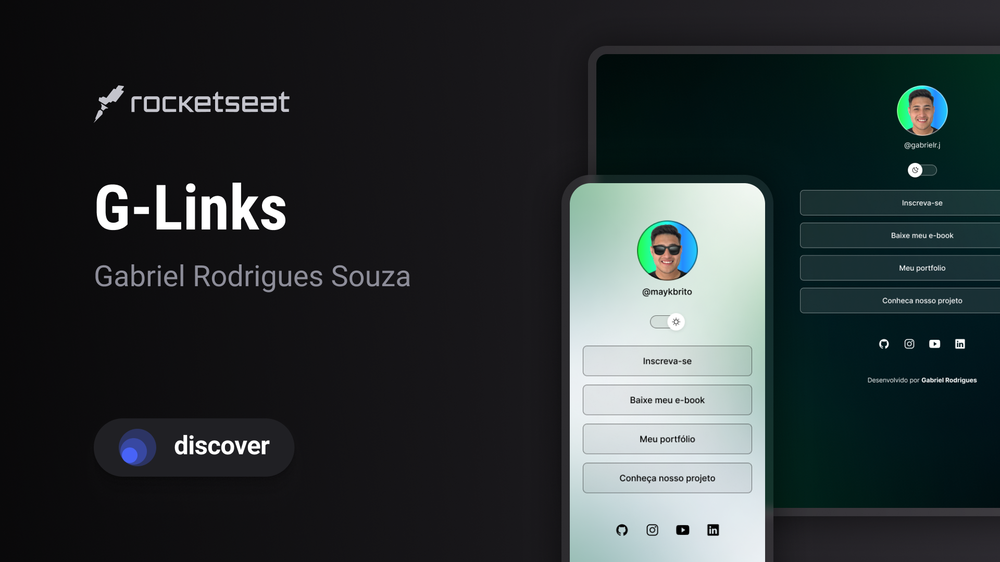

<h1 align="center"> G-Links </h1>

Project of Rocketseat`s Discover course, a introduction of web development fundamentals.

  <a href="#-tecnologys">Tecnologys</a>&nbsp;&nbsp;&nbsp;|&nbsp;&nbsp;&nbsp;
  <a href="#-project">Project</a>&nbsp;&nbsp;&nbsp;|&nbsp;&nbsp;&nbsp;
  <a href="#-layout">Layout</a>&nbsp;&nbsp;&nbsp;|&nbsp;&nbsp;&nbsp;
  <a href="#memo-licence">License</a>

  

 

  

## 🚀 Tecnologys

This project was developed with the following technologies:

- [Javascript](#)
- [HTML](#)
- [CSS](#)
- [Figma](https://www.figma.com/)

## 💻 Project

G-Links is a web page of aggregated links, very common in social media bio fields.

## 🔖 Layout

You can view the project layout through [THIS LINK](https://www.figma.com/design/YtC4mY3W1wtQK12eImHAJY/DevLinks-%E2%80%A2-Discover?node-id=10-620&p=f&t=lgWc3iQJof95ZPTF-0/duplicate). You must have a [Figma](https://figma.com) account to access it.

## :memo: License

This project is under the MIT license.

---

Made with ♥ by me together with Rocketseat
